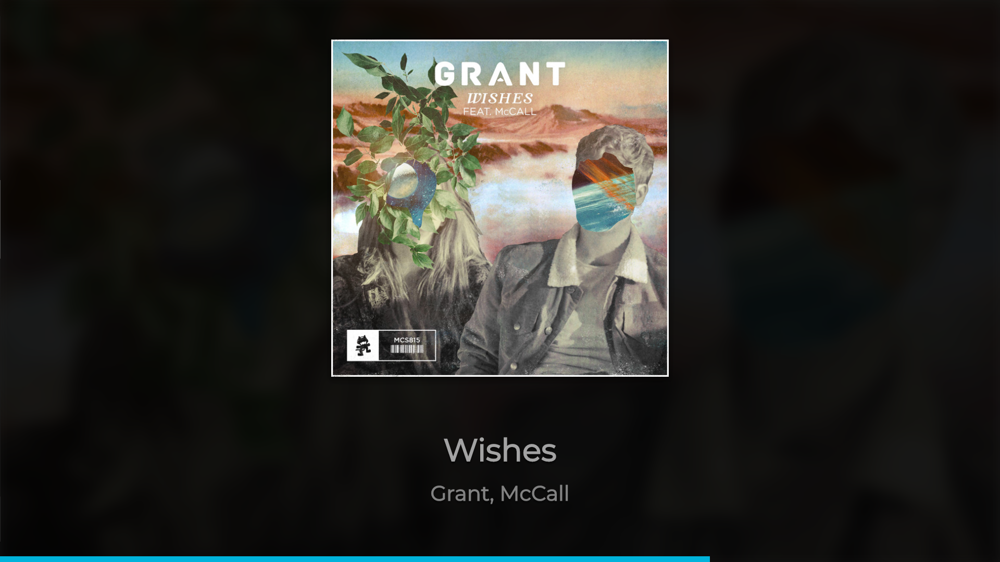

# Spotify Visualizer

Visualize the current playing Spotify track with the album art using the [web API](https://developer.spotify.com/web-api/).

This is a fork of [spotifiy-visualizer](https://github.com/l3d00m/spotify-visualizer) by l3d00m. This fork changes the following:

- Background is darker and less bright.
- Text color is nicer.
- Font is default to Monsterrat.
- Progress bar is light blue.
- Progress bar is 3x smaller giving it a better look.

## How it looks like

    

## How to install and run

1.  Clone the repo with `git clone https://github.com/l3d00m/spotify-visualizer.git`
2.  Install dependencies with `npm install`
3.  Create a file called `.env` in the project root with the secrets (see below)
4.  Optional: if you want the start.bat to work, change the first line with the main-directory in it.
5.  Run with `npm start` or start.bat

### .env secrets
    CLIENT_ID=example-client-id
    CLIENT_SECRET=example-client-secret
    REFRESH_TOKEN=example-refresh-token

1. Create a spotify app [here](https://developer.spotify.com/my-applications/) 
2. Replace `example-client-id` with the client id and `example-client-secret` with the client secret.
3. Open this handy tool: https://grant.outofindex.com/spotify for generating the needed refresh token with the following steps
4. Paste your above client id and secret into the  `app` section on the site
5. On your spotify app `edit settings` > `redirect URIs` add `https://grant.outofindex.com/connect/spotify/callback` then save.
6. Under `scope` add `user-read-currently-playing` and `user-read-playback-state`
7. Now replace `example-refresh-token` in the .env file with the generated refresh-token and you're done

Alternatively you can use the Spotify API directly as described [in their api docs](https://beta.developer.spotify.com/documentation/general/guides/authorization-guide/#authorization-code-flow), but this is needlessly complicated.

### Multiple monitors?

You can switch between your displays with `Ctrl+Shift+Right`.
You can also change the default monitor in `lib/main.js` on line number `9` - keep in mind that numbers start at 0
